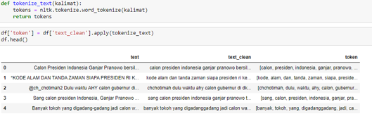
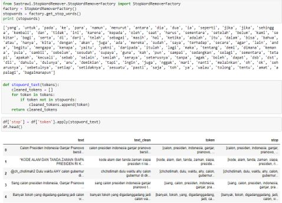
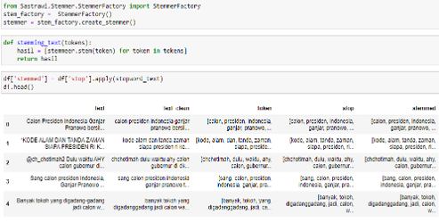
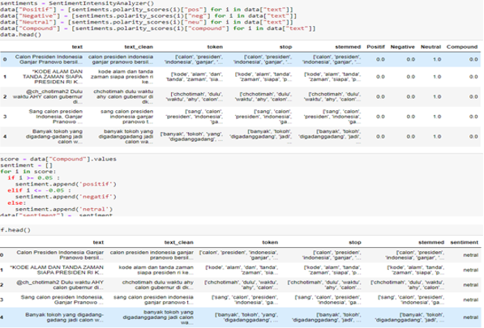
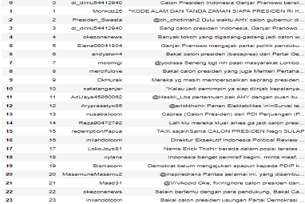

# Komparasi Algoritma Naive Bayes dan Support Vector Machine (SVM) Tentang Popularitas Calon Presiden Pada Pilpres 2024 Mendatang

**Author:** Fadli Nurrizky
**NIM:** 41520010110

---

## 📑 Presentation

[Download PPT Tugas Akhir](./PPT_Tugas_Akhir.pptx)

---

# 📌 BAB 1 - PENDAHULUAN

## Latar Belakang

Di masa komputasi dan internet saat ini, teknologi data sudah menjadi bagian yang tidak bisa dipisahkan dari kehidupan sehari-hari dan dampak positifnya dapat dilihat di berbagai bidang, khususnya dalam konteks pemilihan umum. Hal ini dapat meningkatkan transparansi dan akuntabilitas dalam proses pemilu serta membantu masyarakat membuat keputusan yang lebih tepat.

Salah satu metode yang digunakan dalam pemilihan umum adalah prediksi popularitas calon presiden. Penelitian ini dilakukan menggunakan algoritma Naive Bayes dan Support Vector Machine (SVM) berdasarkan informasi survei yang dapat dipercaya mengenai popularitas calon presiden di masyarakat.

---

## Batasan Masalah

* Studi ini membatasi penggunaan algoritma hanya pada Naive Bayes dan Support Vector Machine.
* Studi ini tidak membahas algoritma lainnya.
* Studi ini tidak membahas program kerja calon presiden.
* Fokus penelitian hanya pada popularitas calon presiden di masyarakat.
* Studi ini tidak membahas faktor-faktor yang mempengaruhi perubahan popularitas calon presiden.

---

## Rumusan Masalah

1. Bagaimana cara mengumpulkan data dari Twitter untuk melakukan analisis sentimen publik terhadap calon Presiden pada Pilpres 2024?
2. Bagaimana mengklasifikasikan sentimen publik terhadap calon Presiden pada Pilpres 2024 menggunakan algoritma Naive Bayes dan Support Vector Machine?
3. Bagaimana mengetahui akurasi algoritma Naive Bayes dan Support Vector Machine?

---

## Tujuan Penelitian

* Menganalisis sentimen publik terhadap calon Presiden pada Pilpres 2024 menggunakan data Twitter.
* Memberikan kontribusi dalam pemahaman tentang pentingnya analisis sentimen publik dalam konteks pemilihan umum.
* Menggunakan algoritma Naive Bayes dan Support Vector Machine untuk melakukan klasifikasi sentimen.

---

# 📚 BAB 2 - KAJIAN TEORI

## Analisis Sentimen

Analisis sentimen politik merupakan penggunaan teknik analisis sentimen untuk memahami opini dan sentimen masyarakat terhadap calon presiden dalam konteks pemilihan presiden.

---

## Naive Bayes

Naive Bayes adalah algoritma klasifikasi probabilistik yang berdasarkan Teorema Bayes. Algoritma ini digunakan untuk mengklasifikasikan teks ke dalam kategori tertentu.

---

## Support Vector Machine (SVM)

SVM adalah algoritma klasifikasi yang bertujuan menemukan batas keputusan optimal antara kategori yang berbeda.

---

# 🧪 BAB 3 - METODE PENELITIAN

## Metode Penelitian

Penelitian dilakukan dengan memanfaatkan data Twitter terkait calon presiden Pilpres 2024.

---

## Populasi dan Sampel

### Populasi

Seluruh pengguna media sosial Twitter yang secara aktif membicarakan atau mencuitkan terkait popularitas calon presiden pada Pilpres 2024 di Indonesia.

### Sampel

Mengambil sampel dari media sosial Twitter yang mengandung kata kunci:

* calon presiden
* capres 2024
* #capres_2024

---

# 📊 BAB 4 - HASIL DAN PEMBAHASAN

## Hasil Penelitian

Hasil penelitian menunjukkan bahwa tingkat akurasi SVM mencapai 97%, sedangkan Naive Bayes mencapai 95%. Oleh karena itu, SVM memiliki performa yang sedikit lebih unggul dalam memprediksi popularitas calon presiden berdasarkan data Twitter.

---

## Pre-Processing

### Text Cleaning

### Tokenizing

### Stopwords Removal

### Stemming

---

## Labeling

---

## Visualisasi Data

### Data Kumulatif

### Popularitas

---

## Akurasi Model

| Algoritma              | Accuracy |
| ---------------------- | -------- |
| Naive Bayes            | 95%      |
| Support Vector Machine | 97%      |

---

# 📝 BAB 5 - KESIMPULAN DAN SARAN

## Kesimpulan

Metode yang digunakan dalam penelitian ini adalah Naive Bayes dan Support Vector Machine. Hasil penelitian menunjukkan bahwa tingkat akurasi SVM mencapai 97%, sedangkan Naive Bayes mencapai 95%. Oleh karena itu, SVM memiliki performa yang sedikit lebih baik dalam memprediksi popularitas calon presiden berdasarkan data Twitter.

Hasil ini mencerminkan persentase popularitas masing-masing calon presiden berdasarkan data yang dianalisis. Ganjar Pranowo memiliki popularitas tertinggi, diikuti oleh Prabowo Subianto, sedangkan Anies Baswedan memiliki popularitas lebih rendah.

---

## Saran

* Mencoba berbagai metode preprocessing data untuk mengevaluasi dampaknya terhadap hasil klasifikasi.
* Menjelajahi variasi metode klasifikasi lain selain Naive Bayes dan SVM.
* Menggabungkan data teks dengan sumber data lain seperti survei atau dukungan partai politik.

---

# 🛠 Technologies Used

* Python
* Pandas
* NumPy
* Scikit-learn
* Google Colab
* Twitter Dataset

---

# 👨‍💻 Author

**Fadli Nurrizky**

---

# 🙏 Thank You
